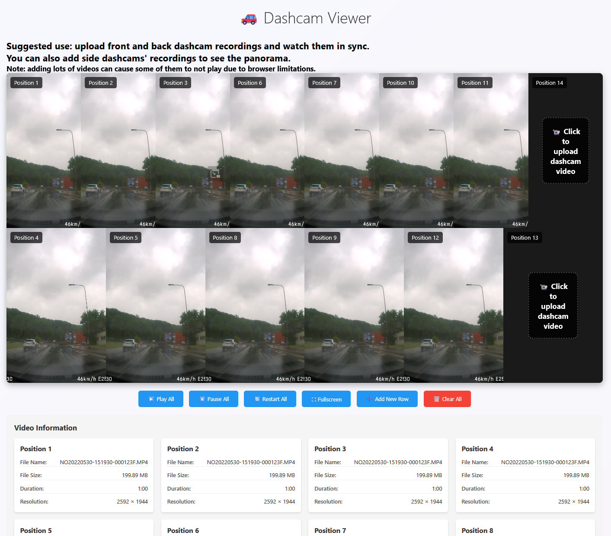
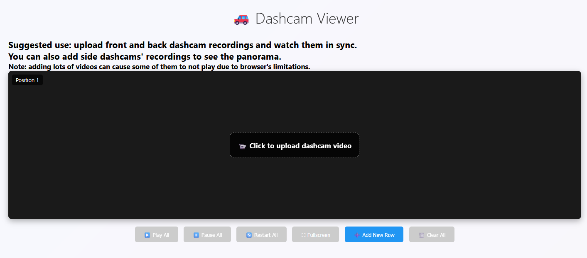

# Dashcam Viewer

## Loaded screen



## Empty screen



## Functionality

1. Upload videos. User can upload horizontally to make a panorama or add new rows of videos.
2. Play/pause all videos at the same time to keep them in sync.
3. Restart all videos if they come out of sync.
4. Enter fullscreen mode.
5. Clear all videos to start uploading anew.
6. View uploaded videos' statistics.

## Running locally

```
npm install
npm run serve
```

Navigate to `http://127.0.0.1:8080/public/index.html`.

## License

Please read a `LICENSE` file.